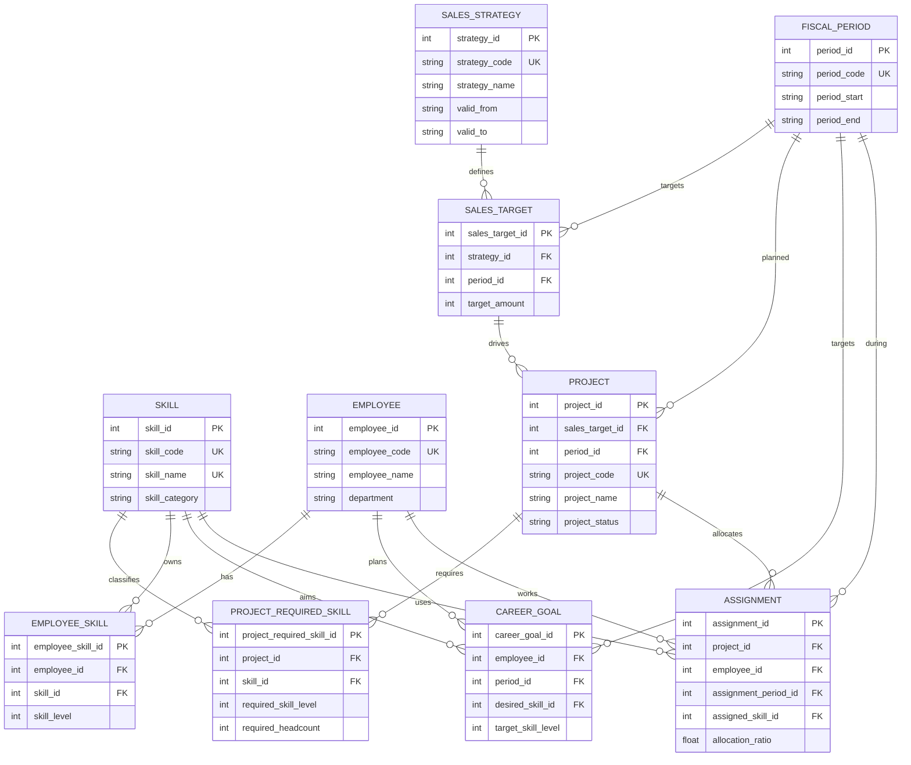

# マスタ管理Wiki

## 役割
このセクションでは、サービスが保持する正規化済みテーブルを直接閲覧・編集します。
各ページの編集結果は同一セッション内で保持され、入力ページや出力ページはこれらのテーブルを JOIN して表示します。

## ER図

## テーブル一覧

### 成長戦略
- 種別: マスタ
- 役割: 成長戦略のヘッダです。売上目標群を束ねます。
- カラム: strategy_id, strategy_code, strategy_name, valid_from, valid_to

### 時期マスタ
- 種別: マスタ
- 役割: 四半期や月を統一管理します。
- カラム: period_id, period_code, period_start, period_end

### 売上目標
- 種別: トラン
- 役割: 成長戦略ごとの時期別売上目標です。
- カラム: sales_target_id, strategy_id, period_id, target_amount

### スキルマスタ
- 種別: マスタ
- 役割: スキル名とカテゴリを統一管理します。
- カラム: skill_id, skill_code, skill_name, skill_category

### 社員マスタ
- 種別: マスタ
- 役割: 社員コードと所属を管理します。
- カラム: employee_id, employee_code, employee_name, department

### 社員保有スキル
- 種別: トラン
- 役割: 社員が現在持つスキルとレベルを管理します。
- カラム: employee_skill_id, employee_id, skill_id, skill_level

### キャリア目標
- 種別: トラン
- 役割: 社員が将来目指すスキルとレベルを管理します。
- カラム: career_goal_id, employee_id, period_id, desired_skill_id, target_skill_level

### 案件ヘッダ
- 種別: トラン
- 役割: 売上目標から導かれた仮想PJを管理します。
- カラム: project_id, sales_target_id, period_id, project_code, project_name, project_status

### 案件必要スキル
- 種別: トラン
- 役割: 案件ごとの要求スキルと必要人数を管理します。
- カラム: project_required_skill_id, project_id, skill_id, required_skill_level, required_headcount

### アサイン
- 種別: トラン
- 役割: 案件と社員の割当結果を管理します。
- カラム: assignment_id, project_id, employee_id, assignment_period_id, assigned_skill_id, allocation_ratio
