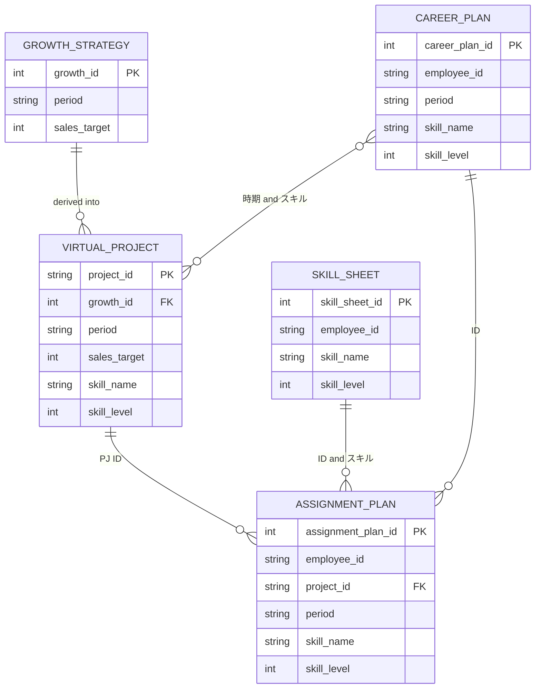

# Streamlit管理データの現状ER図

## 概要
このモックでは、Streamlitのセッション状態で5種類のDataFrameを管理しています。
下記ER図は、現在のDataFrame構造をそのまま理解しやすい論理モデルに整理したものです。
成長戦略は概念上は売上目標ですが、現行モックでは `お金` カラム名で保持しています。

## ER図

## 管理データ一覧

### 成長戦略
時期ごとの売上目標を管理する入力データです。現行モックでは売上目標を `お金` カラムに格納しています。

| カラム | 型 | 備考 |
| --- | --- | --- |
| 時期 | string/int | 期間軸 |
| お金 | string/int | 現行モックでは売上目標を格納 |

### キャリア計画
社員ごとの希望時期・希望スキル・希望レベルを管理する入力データです。

| カラム | 型 | 備考 |
| --- | --- | --- |
| ID | string/int | 他データとの関連に使う識別子 |
| 時期 | string/int | 期間軸 |
| スキル | string/int | スキル名 |
| スキルのLv | string/int | スキルレベル |

### スキルシート
社員ごとの保有スキルと現在レベルを管理する入力データです。

| カラム | 型 | 備考 |
| --- | --- | --- |
| ID | string/int | 他データとの関連に使う識別子 |
| スキル | string/int | スキル名 |
| スキルのLv | string/int | スキルレベル |

### 仮想PJ
成長戦略から疑似生成される案件データです。

| カラム | 型 | 備考 |
| --- | --- | --- |
| PJ ID | string/int | 他データとの関連に使う識別子 |
| 時期 | string/int | 期間軸 |
| お金 | string/int | 現行モックでは売上目標を格納 |
| スキル | string/int | スキル名 |
| スキルのLv | string/int | スキルレベル |

### アサイン計画
仮想PJと人材情報を突き合わせて生成される結果データです。

| カラム | 型 | 備考 |
| --- | --- | --- |
| ID | string/int | 他データとの関連に使う識別子 |
| PJ ID | string/int | 他データとの関連に使う識別子 |
| 時期 | string/int | 期間軸 |
| スキル | string/int | スキル名 |
| スキルのLv | string/int | スキルレベル |

## 関連の見方
- `仮想PJ` と `アサイン計画` は `PJ ID` で結び付きます。
- `キャリア計画` と `スキルシート` と `アサイン計画` は `ID` を通じて社員単位で参照できます。
- `成長戦略` と `仮想PJ` は、成長戦略から仮想PJが導出される関係です。
- `キャリア計画` と `仮想PJ` は `時期` と `スキル` の組み合わせで、疑似的にマッチングされます。
