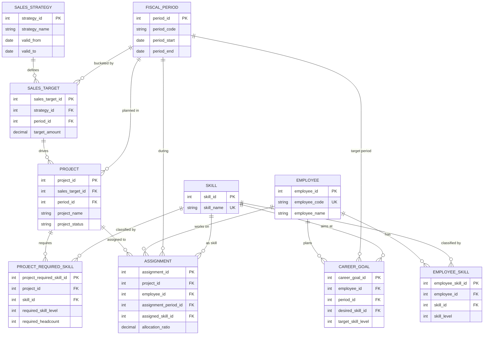

# 理想データモデルER図

## 前提
- `成長戦略` は投資金額ではなく、時期ごとの売上目標を表します。
- `仮想PJ` は `成長戦略` から直接ではなく、`売上目標` を起点として導出されます。
- 現行モックのフラットなDataFrameを正規化し、マスタとトランザクションを分離します。

## 正規化の方針
- `時期` は `FISCAL_PERIOD` に切り出します。
- `スキル` は `SKILL` マスタに切り出します。
- `社員` は `EMPLOYEE` に切り出し、保有スキルは `EMPLOYEE_SKILL` に分離します。
- `キャリア計画` は `CAREER_GOAL` として社員・時期・目標スキルの組み合わせで管理します。
- `仮想PJ` は `PROJECT` と `PROJECT_REQUIRED_SKILL` に分割し、1案件に複数スキルを持てるようにします。
- `アサイン計画` は `ASSIGNMENT` として案件と社員の関連テーブルにします。

## ER図

## あるべきテーブル

### SALES_STRATEGY
成長戦略のヘッダです。戦略名や有効期間など、戦略そのものの属性を持ちます。

| カラム | 役割 |
| --- | --- |
| strategy_id | 主キー |
| strategy_name | 戦略名 |
| valid_from | 適用開始日 |
| valid_to | 適用終了日 |

### FISCAL_PERIOD
四半期や月など、全テーブル共通で参照する時期マスタです。

| カラム | 役割 |
| --- | --- |
| period_id | 主キー |
| period_code | `2026-Q1` のような業務コード |
| period_start | 開始日 |
| period_end | 終了日 |

### SALES_TARGET
成長戦略ごとの時期別売上目標です。成長戦略と仮想PJを接続する中核テーブルです。

| カラム | 役割 |
| --- | --- |
| sales_target_id | 主キー |
| strategy_id | `SALES_STRATEGY` への外部キー |
| period_id | `FISCAL_PERIOD` への外部キー |
| target_amount | 売上目標金額 |

### SKILL
スキル名の表記ゆれを防ぐためのスキルマスタです。

### EMPLOYEE
社員マスタです。現在の `ID` はここに吸収されます。

### EMPLOYEE_SKILL
社員が持つスキルとレベルの関連テーブルです。

| カラム | 役割 |
| --- | --- |
| employee_skill_id | 主キー |
| employee_id | `EMPLOYEE` への外部キー |
| skill_id | `SKILL` への外部キー |
| skill_level | 現在レベル |

### CAREER_GOAL
社員ごとの将来時点の目標スキルと目標レベルです。現行のキャリア計画を正規化した形です。

| カラム | 役割 |
| --- | --- |
| career_goal_id | 主キー |
| employee_id | `EMPLOYEE` への外部キー |
| period_id | 目標時期 |
| desired_skill_id | 目標スキル |
| target_skill_level | 目標レベル |

### PROJECT
成長戦略由来の案件ヘッダです。どの売上目標から生まれた案件かを持ちます。

| カラム | 役割 |
| --- | --- |
| project_id | 主キー |
| sales_target_id | `SALES_TARGET` への外部キー |
| period_id | 実施時期 |
| project_name | 案件名 |
| project_status | 状態 |

### PROJECT_REQUIRED_SKILL
案件が要求するスキルを行単位で管理します。1案件多スキルに対応します。

| カラム | 役割 |
| --- | --- |
| project_required_skill_id | 主キー |
| project_id | `PROJECT` への外部キー |
| skill_id | `SKILL` への外部キー |
| required_skill_level | 要求レベル |
| required_headcount | 必要人数 |

### ASSIGNMENT
案件と社員のアサイン結果です。必要に応じて配賦率や担当スキルを保持します。

| カラム | 役割 |
| --- | --- |
| assignment_id | 主キー |
| project_id | `PROJECT` への外部キー |
| employee_id | `EMPLOYEE` への外部キー |
| assignment_period_id | アサイン時期 |
| assigned_skill_id | 担当スキル |
| allocation_ratio | 稼働率 |

## この構成で解消される問題
- `時期` や `スキル` の文字列重複がなくなります。
- `成長戦略` と `仮想PJ` の関連が `SALES_TARGET` を介して明示されます。
- 案件に複数スキルを持たせられるため、現実的な案件定義に近づきます。
- 社員の現有スキルと将来目標スキルを分けて扱えるため、評価軸が明確になります。
- `ASSIGNMENT` を純粋な関連テーブルにでき、案件・社員・時期の関係が追いやすくなります。
